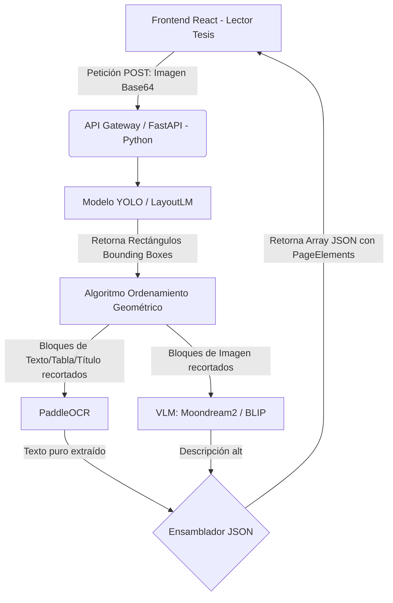

# Análisis Arquitectónico: Creación de IA Propia para Lector Estructural PDF

## 1. Planteamiento del Problema
Actualmente, el sistema funciona enviando un renderizado base64 de la página PDF a una API comercial de inteligencia artificial masiva (e.g., Gemini 1.5 Flash). Si bien esto soluciona el problema de extracción de estructura lógica (diferenciación de títulos, párrafos, tablas y reconocimiento de imágenes), genera dependencia de terceros y costos. 

Para que el proyecto final de la tesis logre autonomía tecnológica, sea académicamente riguroso y operativamente viable sin depender de un modelo monolítico comercial, es necesario proponer y desarrollar una **arquitectura de Inteligencia Artificial propia** (un sistema local de extracción lógica de documentos).

## 2. Desacoplamiento Frontend-Backend
El actual frontend (Desarrollado en React) se ha diseñado empleando un alto grado de abstracción mediante la interfaz `PageElement`. 
```typescript
type ElementType = 'heading' | 'paragraph' | 'image' | 'table';
```
El único requisito de integración de la futura IA local es exponer una API HTTP (ej. un Endpoint `/analyze` construido en **Python con FastAPI**) que reciba una imagen en Base64 y devuelva un JSON estructurado con el orden de lectura semántico, haciendo que el frontend **no requiera ninguna refactorización**.

## 3. Propuesta de Arquitectura: "Pipeline Especializado"
Implementar una única Red Neuronal capaz de abstraer toda la complejidad semántica requiere un hardware masivo. El enfoque propuesto se basa en un **Pipeline de Modelos de IA Especializados (Ensemble)**.

El ciclo de vida del procesamiento de una página consta de 4 etapas que se ejecutan en microsegundos dentro del backend:

### A. Document Layout Analysis (DLA) - Detección de Componentes
El primer modelo será uno de **Visión Computacional para Detección de Objetos (Object Detection)**. Su función es examinar la página del PDF renderizada como imagen y generar "Bounding Boxes" (cajas de delimitación) etiquetando cada bloque visual.
* **Modelo Sugerido:** `DocLayout-YOLO`, `YOLOv11` o `LayoutLMv3`.
* **Proceso (Tesis):** Se requiere el entrenamiento o *fine-tuning* del modelo utilizando datasets académicos (PubLayNet, DocLayNet, FUNSD) para ajustarse a 4 clases principales: `Titulo`, `Texto`, `Imagen`, `Tabla`.
* **Salida:** Coordenadas espaciales `(x, y, width, height, class)`.

### B. Algoritmo Geométrico de Orden de Lectura (Reading Order)
Una vez detectadas las cajas, no existe una garantía de que la red neuronal devuelva la salida en el orden semántico correcto en el que leería un ser humano.
* **Proceso:** Implementación de un algoritmo basado en grafos o un heurístico XY-cut para ordenar las coordenadas de forma descendente (arriba a abajo) y, en el caso de múltiples columnas, de izquierda a derecha.

### C. Reconocimiento Óptico de Caracteres Dirigido (Directed OCR)
En lugar de pasar toda la página completa por un OCR tradicional y luego intentar adivinar los formatos, el OCR solo procesará los bloques individuales que el modelo DLA catalogó como texto o tablas.
* **Modelo Sugerido:** `PaddleOCR` (Superior en rendimiento y velocidad a Tesseract en producción).
* **Proceso:** Recortar los fragmentos exactos de la imagen original usando las coordenadas previamente ordenadas y extraer su texto.

### D. Image Captioning mediante Modelos de Visión-Lenguaje Ligeros (VLM)
Cuando el modelo DLA detecte una `Imagen`, dicha región se recortará y se enviará a un modelo especializado en entendimiento de visión.
* **Modelo Sugerido:** Modelos locales de Visión-Lenguaje de tamaño pequeño, por ejemplo `Moondream2` (1.8 Billones de parámetros) o `BLIP` (Bootstrapping Language-Image Pre-training).
* **Proceso:** El modelo VLM generará una descripción textual contextualizada de la imagen, proveyendo accesibilidad absoluta al usuario ciego sin requerir conectividad de internet para llamadas API comerciales externas.

## 4. Diagrama de Flujo del Proceso (Arquitectura Deseada)



## 5. Hoja de Ruta de Implementación
Para la tesis, se propone dividir la creación de esta IA en los siguientes hitos de ingeniería:
1. **Recopilación y Preprocesamiento de Datos:** Recopilar y anotar documentos objetivo (artículos científicos, libros).
2. **Entrenamiento del Modelo Base DLA:** Fine-tuning de la red YOLO y medición de su rendimiento (Métricas de precisión y *Recall*).
3. **Construcción del Pipeline Lógico:** Integración del DLA con el script de recorte geométrico y PaddleOCR.
4. **Integración del VLM:** Conexión del generador de texto (Moondream2) en el motor Python.
5. **Despliegue de Interfaz API:** Exponer el sistema completo a través de FastAPI (localhost o servidor remoto) y cambiar la URL de conexión en React.
